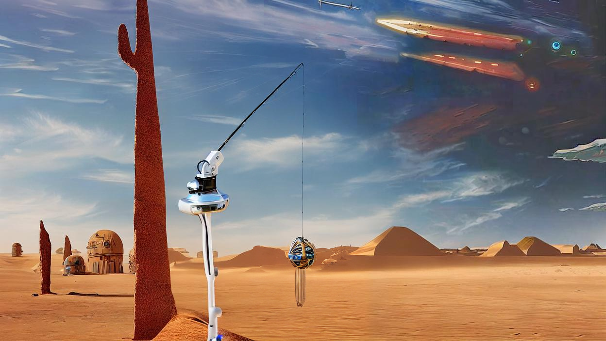

## Plai - The AI Robotic Cat Toy

Plai is an AI robotic cat toy that uses advanced technology to play with your cat. Plai uses two robotic servos to hold a rod with a string attached to the end of the rod. When your cat is near, Plai can detect it and start wiggling the string to invite the cat to play. Plai is written in Python and uses Tensorflow, OpenCV, and Gradio as its dependencies.

Plai is the perfect way to keep your cat entertained and help them stay active. With Plai, you can play with your cat even when you're not home. Plai can also help reduce stress and anxiety in cats by providing them with a consistent source of stimulation.

We're now running a Kickstarter campaign to help make Plai a reality. Donate today and help us bring this innovative robotic cat toy to life. Your contribution will help fund the development needed to develop Plai. Thank you for your support!

** Everything in this README is AI generated. **